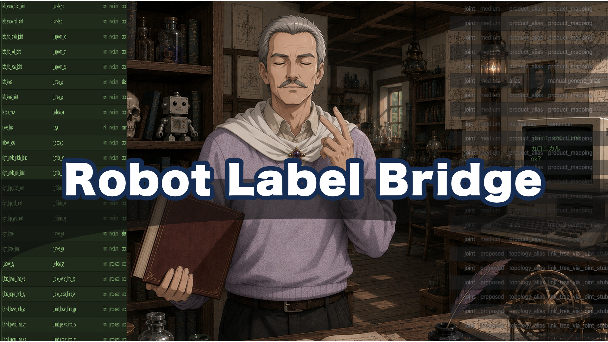

# RobotLabelBridge

[English](README.md) | [日本語](README_jp.md)



A Python module that maps robot joint / link names onto the short official labels used inside the project—often called **canonical** short names.  
`LeftHip`, `hip_pitch_joint`, and `l_hip` may all mean the same axis while looking different. Like deciding one legal name even when someone has many nicknames, RobotLabelBridge settles on one shared label for everyday use.

Names from URDF, MJCF, ROS, or vendor-specific formats often mean the same thing while looking different. That mismatch causes conversion bugs, missed lookups, and control mistakes. RobotLabelBridge is the bridge between those dialects and one common naming scheme.

It looks like a “name conversion library,” but underneath it keeps a light organization of meanings—an **ontology** in the practical sense: whether something is a body part, a commanded axis, only another spelling, and how parts connect as parent and child. This is not a heavyweight academic OWL stack; it is a small semantic model that makes wrong mappings harder. Day to day you use the short official names and conversion APIs; that organization stays in the background.

| File | Role |
|---|---|
| `RobotLabelBridge.py` | Conversion APIs, ontology registry, validation, rename, Viewer |
| `RobotLabelBridge_Master.json` | Canonical definitions, aliases, link hierarchy, and other master knowledge |

- Python API: **2.2.0**
- Master: `schema_version` **2.2** / `ontology_version` **1.2**

---

## What it is for

### Goals

1. **Standardize names**  
   Map names such as `LeftHip`, `hip_pitch_joint`, or `l_hip` onto a shared short form (e.g. `l_hipjoint_yp`).
2. **Prevent semantic mix-ups**  
   Keep “looks similar” separate from “actually refers to the same joint/link.”
3. **Automate model conversion**  
   Batch-rename joints in URDF/MJCF with collision checks.
4. **Integrate with LegacyMotionEditor**  
   Build rename plans for models loaded in the editor under the same rules.

### Good fits

- Working across humanoid / animal morphologies from multiple vendors and formats
- Reusing motion data or control logic across robot models
- Resolving “which canonical name does this alias mean?”
- Disambiguating names with parent/child topology

### Not intended for

- Physics simulation itself
- Replacing a full formal OWL ontology stack for academic KR work
- Silently forcing an ambiguous candidate into a single answer (intentionally avoided)

---

## What it keeps distinct internally

RobotLabelBridge is not just a string rewrite table.  
Inside the Master JSON and `OntologyRegistry` it separates meanings such as:

| Concept | Plain meaning | Example surface name |
|---|---|---|
| **Canonical label** | Shared short name used by the app | `l_knee_yp` |
| **Alias** | External spelling / legacy name | `LeftKnee`, `knee_pitch_joint` |
| **FunctionalJoint** | Functional joint concept (“left knee”) | internal id: `joint:l:knee` |
| **DegreeOfFreedom** | One controllable / serialized axis | `l_knee_yp` |
| **KinematicJoint** | Physical connection between links | actuated or passive |
| **PhysicalLink / VirtualLink** | Rigid body, or an axis-decomposition node | `l_leg_upper` |
| **link_tree** | Parent/child spanning tree (kept acyclic) | parent / children |
| **KinematicLoop, etc.** | Closed-chain mechanism (only when needed) | `l_knee_lp` |

Keeping those distinctions helps when:

- different spellings mean the same joint, or similar spellings mean different ones
- functional joints, commanded axes, and physical pivots must not be collapsed
- conversion decisions need provenance
- Master integrity should be checked mechanically

OWL files and rdflib are not required. If needed, `iter_semantic_triples()` can export RDF-like triples.  
Everyday use does not require thinking about this layer: `canonicalize_*` and `convert_with_provenance` resolve names through the internal registry. To inspect it directly:

```python
from RobotLabelBridge import get_ontology_registry

reg = get_ontology_registry()
reg.dofs_by_label["l_knee_yp"]       # DegreeOfFreedom
reg.links_by_label["l_leg_upper"]    # Link
reg.functional_joints                # functional joints
```

---

## Benefits

| Benefit | Detail |
|---|---|
| **Short, consistent names** | Labels such as `l_shoulder_yp` encode side, part, and axis |
| **Semantic model** | Aliases, joints, axes, links, and topology are more than raw strings |
| **Alias-friendly** | Legacy and product names are absorbed via the Master alias index |
| **Ambiguity stays visible** | Multiple candidates can return AMBIGUOUS instead of a silent wrong pick |
| **Provenance** | Track which alias / topology / heuristic produced a result |
| **Tree stays clean** | Ordinary parent/child links live in `link_tree`; closed loops are separate |
| **Headless-ready** | Conversion and validation work without PySide6 |
| **Editor integration** | Same rules drive rename flows in LegacyMotionEditor |

In short: it translates naming dialects into a common language, and uses an internal semantic model to make mistranslation harder.

---

## Naming rules (short official names)

This is the heart of RobotLabelBridge: the shape of the short official names used across the project.

### Basic pattern

```text
DOF / joint axis:  [l|r|c]_<part>_[optional_index]_<axis>
link:              [l|r|c]_<part_or_segment>
```

| Piece | Meaning | Example |
|---|---|---|
| `l` / `r` / `c` | left / right / center | `l_...`, `c_pelvis` |
| `<part>` | functional location | `shoulder`, `knee`, `hipjoint` |
| `_01`, `_02`, … | index when the same part repeats | `l_spine_01_yp` |
| `<axis>` | short axis token | `xr` / `yp` / `zy` |

### Axis tokens

| Short | Meaning | Approx. axis |
|---|---|---|
| `xr` | roll | X |
| `yp` | pitch | Y |
| `zy` | yaw | Z |

Long forms are `xroll` / `ypitch` / `zyaw`, but  
**canonical short names use `xr` / `yp` / `zy`.**

### Examples

| Kind | Canonical short name | Reading |
|---|---|---|
| DOF | `l_shoulder_yp` | left shoulder pitch |
| DOF | `l_hipjoint_yp` | left hip-joint pitch |
| DOF | `c_head_zy` | head yaw |
| Link | `l_arm_upper` | left upper arm |
| Link | `l_leg_lower` | left lower leg |
| Link | `c_pelvis` | pelvis (center) |

### Common pitfalls

- **Do not use bare `hip` or `waist` as canonical names**  
  - hip articulation → `hipjoint`  
  - waist / root area → `pelvis` / `pelvis_root`, etc.
- **Side prefixes are `l_` / `r_` / `c_`**  
  `left_` / `right_` are legacy (accepted via aliases)
- **Canonical link targets are usually short**  
  ROS-style long names live in separate fields when needed
- **Singleton numbering**  
  A single level may omit `_01`.  
  When a second level appears, rename the original to `_01` and add `_02`

### Names for closed-loop mechanisms

Ordinary joint and link names stay unchanged.  
The closed-loop structure itself gets a separate short name:

```text
loop:     [l|r|c]_<landmark>_lp[_NN]
branch:   <loop>_bNN
closure:  <loop>_cl[_NN]
```

Example:

```text
l_knee_lp
l_knee_lp_b01
l_knee_lp_b02
l_knee_lp_cl
```

Mechanism types such as `four_bar` or `pantograph` are attributes, not part of the identity name.  
Even a four-bar knee still keeps the DOF label `l_knee_yp`.

---

## Naming layers (easy to confuse)

The word “joint” covers several different kinds of thing inside the model:

| Term | What it means | Example |
|---|---|---|
| **Canonical short name** | Shared app-facing label | `l_knee_yp` |
| **Alias** | Incoming external spelling | `LeftKnee`, `knee_pitch_joint` |
| **FunctionalJoint** | Functional concept (“left knee”) | `joint:l:knee` |
| **DegreeOfFreedom** | One actuated / serialized axis | `l_knee_yp` |
| **KinematicJoint** | Physical connection between links | actuated or passive |
| **Link** | Rigid body part | `l_leg_upper` |

Key separations:

- **DOF ≠ every physical pivot**  
  Do not invent servo names for passive joints
- **Functional joint ≠ kinematic joint**  
  One “knee” may be realized by several physical pivots
- **Parent/child tree ≠ closed loop**  
  Ordinary body chains are a tree; loop mechanisms are stored separately

That separation is why conversion can go beyond plain string matching.

---

## Usage

### 1. Simplest conversion

```python
from RobotLabelBridge import (
    canonicalize_best_effort,
    canonicalize_strict,
)

# Return the top candidate (convenient; can still be wrong)
canonicalize_best_effort("l_hip")
# -> "l_hipjoint_yp"

# Return a value only when uniquely resolved; else None
canonicalize_strict("ShoulderJoint", entity="joint")
# -> None (e.g. multiple candidates)
```

`entity` may be `"joint"`, `"link"`, `"loop"`, or `"auto"`.

### 2. Conversion with provenance (recommended)

```python
from RobotLabelBridge import convert_with_provenance, NameConverter

result = convert_with_provenance(
    "HipJoint",
    entity="joint",
    parent="c_pelvis",
    child="l_leg_upper",
    axis=[0, 1, 0],
    morphology="humanoid",
)

print(result.status)            # resolved / ambiguous / unresolved
print(result.target)            # chosen canonical name, if any
print(result.reason_codes)      # why that decision was made
print(result.score_components)  # score breakdown
print(result.candidates)        # candidate list
```

Parent link, child link, axis vector, and similar context improve accuracy.

### 3. Topology helpers

```python
from RobotLabelBridge import parent_link, ancestor_links, children_links

parent_link("l_leg_upper")     # e.g. c_pelvis
ancestor_links("l_foot")       # ancestors toward the root
children_links("c_pelvis")     # direct child links
```

### 4. Convert a model file

```python
from RobotLabelBridge import convert_model_file

# Read URDF / MJCF and build a rename plan
report = convert_model_file("/path/to/robot.urdf")
```

In LegacyMotionEditor you can also follow  
`plan_joint_rename` → review → apply on a loaded model.

### 5. Validate the Master

```python
from RobotLabelBridge import validate_master

raw = validate_master(stage="raw")        # on-disk integrity
mig = validate_master(stage="migrated")  # post-normalization referential checks

print(raw.ok, mig.ok)
print(mig.summary())
```

### 6. Command line

```bash
# Viewer (aliases / link tree / loops / conversion preview)
python RobotLabelBridge.py

# Master validation (shows RAW and MIGRATED)
python RobotLabelBridge.py --validate-master

# Built-in self-test
python RobotLabelBridge.py --self-test

# Write mechanical Master repairs back to disk
python RobotLabelBridge.py --migrate-master

# Sample semantic triples
python RobotLabelBridge.py --dump-triples
```

Only the Viewer needs PySide6.  
Conversion, validation, and registry use work headlessly.

---

## Reading the Master data

`RobotLabelBridge_Master.json` is the knowledge base.

| Section | Contents |
|---|---|
| `servo_targets` | Canonical DOF (actuated axis) definitions |
| `link_targets` | Canonical link definitions |
| `alias_index` | alias → canonical label |
| `link_tree` | Parent/child spanning tree (kept acyclic) |
| `kinematic_joints` | Explicit physical joints (especially passive); empty if unused |
| `loop_targets` | Closed-loop definitions; empty if unused |

Use `load_master()` for a dict, or `get_ontology_registry()` for a typed view.

```python
from RobotLabelBridge import get_ontology_registry

reg = get_ontology_registry()
reg.dofs_by_label["l_knee_yp"]
reg.links_by_label["l_leg_upper"]
reg.get_loop("l_knee_lp")            # when defined
reg.get_kinematic_joint("...")       # when defined
```

---

## Handling ambiguity

| API | When ambiguous |
|---|---|
| `canonicalize_strict` | returns `None` (safe) |
| `canonicalize_best_effort` | returns the top candidate (convenient) |
| `NameConverter.convert` / `convert_with_provenance` | `ambiguous` status plus candidates |

Recommended practice:

- Strict research / automation paths → `strict`
- Human-assisted workflows → `best_effort` or provenance APIs
- Do not silently promote a guess to a canonical fact

---

## Link tree and closed loops (advanced)

Ordinary robots are modeled as a **parent/child tree**:

```text
c_base_link
 └─ c_pelvis
     └─ l_leg_upper
         └─ l_leg_lower
             └─ l_foot
```

For mechanisms that form a loop (four-bar, parallelogram, etc.),  
adding the closing edge into the tree breaks ancestor queries and “tree bug” detection.

RobotLabelBridge therefore separates:

- **Tree (`link_tree`)** — everyday parent/child relations; no cycles
- **Closed loops (`loop_targets`)** — where and how the chain closes

Models without closed loops can leave that section empty.

---

## Using it from LegacyMotionEditor (overview)

Typical editor flow:

1. Load a robot model
2. Build a rename plan with RobotLabelBridge
3. Review collisions and unresolved names
4. Apply when clean

UI details live in the editor menus.  
Rules, dictionaries, and validation live in this module and the Master JSON.

---

## Design commitments

1. Canonical names stay short; side, part, and axis should be readable
2. Put external spellings in aliases; do not explode the canonical set
3. Never treat ambiguity as silent success
4. Do not invent missing anatomy into the Master
5. Do not rename existing joints/links merely because they participate in a loop
6. Do not encode closed loops as cycles inside `link_tree`

---

## Versions

| Item | Value |
|---|---|
| Python API | 2.2.0 |
| `schema_version` | 2.2 |
| `ontology_version` | 1.2 |

After editing the Master in-process, call `reload_master()` to refresh caches.

---

## Summary

RobotLabelBridge is a dictionary + converter that translates robot names into shared short official labels.  
Underneath, it keeps a light organization of joints, axes, links, aliases, and topology so spelling and meaning stay distinct.

- **Purpose**: use the same labels for the same meanings across models and formats
- **Usage**: `canonicalize_*` / `convert_with_provenance` / CLI / editor integration
- **Naming**: `[l|r|c]_<part>_<axis>` as the default short form
- **Internals**: separates spelling from meaning (OWL not required)
- **Benefits**: alias-friendly, ambiguity-aware, provenance-backed conversion

Start with `canonicalize_best_effort("your_joint_name")`.  
For production paths, prefer `convert_with_provenance(...)` or `canonicalize_strict(...)`.
